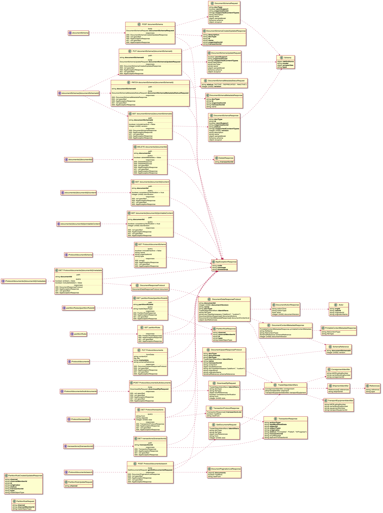

# Freight Trust Network

- [Freight Trust Network](#freight-trust-network)
  - [Network Overview](#network-overview)
  - [EDI Messages](#edi-messages)
  - [Nodes](#nodes)
    - [Network Nodes](#network-nodes)
    - [Concensus Nodes](#concensus-nodes)
  - [Protocol](#protocol)
  - [Burgess](#burgess)
    - [Unit Concepts](#unit-concepts)
  - [Blocks as `units of agreement`](#blocks-as--units-of-agreement-)
    - [Facts](#facts)
    - [Rules](#rules)
  - [Rulebook](#rulebook)
  - [Further Documentation](#further-documentation)
  - [License](#license)

# Abstract

Business A and Business B have a `transaction`, in this example the transaction
is a shippment of freight. This diagram shows at a high level how we facilitate
these business `transactions` in a distributed, fault tolerant network utilziing
hyperledger besu. Censorship resistance and high availability are some of the
more important aspects of utilizing a blockchain network, in addition to
providing for a provably electronically unique piece of data (i.e. this is why
cryptocurrencies work in the first place).

## Network Overview

## EDI Messages

> Note EDI Messages are NOT $EDI Tokens. $EDI Tokens represent the unit of
> account for Units of Agreement and Units of Execution (i.e. think of it just
> as you would think of gwei for ethereum, a fixed unit of cost per byte for
> transacting on the network.)

Charging on a `per byte` basis has been and continutes to be the basis of all
transactional cost models especially EDI and XML messages which provide an
incentive for users not to spam the network with unnecessarily large messages.

## Nodes

There are 5 different classes of nodes, with 2 groups.

- Network Nodes
- Concensus Nodes

### Network Nodes

Besu-tx: Handling of local transaction pool.

Besu-sync: Handling of blockchain synchronisation through Ethereum P2P network.

Besu-query: Handling of database queries.

### Concensus Nodes

Sealer

In general concept terms, a Sealer adds its testimony (assertion of
authentication assessment) and proof of custody to the chain of custody.

Validator

In general concept terms, a Validator inspects the chain of custody to determine
the content and validity of individual evidence supplied by custodians.

## Protocol

## Burgess

Burgess is the collection of rules and dogma. You can ignore this section if you
are not interested in the `legal` aspects of our implementation.
[We suggest visting the blog to find out more first](https://medium.com/freighttrust)

#### Unit Concepts

- Units of Execution
- Units of Agreement
- Units of Afferent
- Units of Efferent
- Units of Lexigram

* Controlled Natural Language = Jurisdictional Grammar (see
  [Burgess](https://github.com/freight-trust/burgess) )
* Afferent = Towards
* Efferent = Away

## Blocks as `units of agreement`

A couple of specific block linkages are stated as facts. Two general principles
of block chaining based on such linkages are stated as "conclusion if condition"
rules.

> (The diagrams' color coding is extended to the symbolic form by using green
> for facts and their rule-condition counterparts while using red for rule
> conclusions and the recursive rule-condition counterpart.)

### Facts

- "Block1 links to Block2."
- "Block2 links to Block3."

### Rules

- "x chains to y if x links to y."
- "x chains to z if x links to y and y chains to z."

Facts are _primitives_ (i.e. not containing variables) that apply a `predicate`
to `arguments`

to Block1 followed by Block2 and to Block2 followed by Block3

Rules are of the form `conclusion :- condition` (i.e. containing variables),
with the Prolog-like (symbol) infix `":-"` corresponding to the above "if".

This constitutes the extent of which RuleML is applied to the `TradeDocs`
system, a basic primitive set for `rule-conditions`

## Rulebook

[see full omnibus](https://ft-docs.netlify.app)

## Further Documentation

[see full omnibus](https://ft-docs.netlify.app)

## License

Mozilla Public License 2.0
